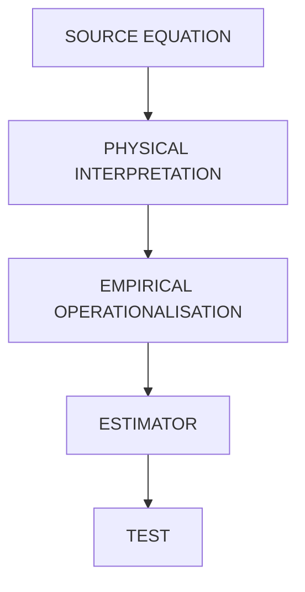
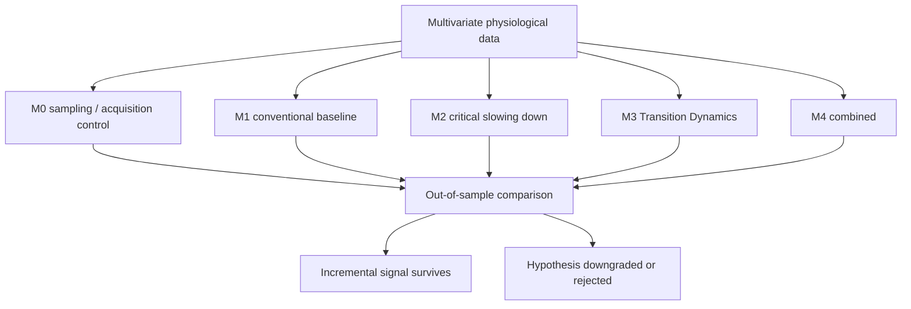

# Transition Dynamics

Does the multivariate structure of physiological measurements change in a
detectable way *before* conventional criteria say a patient has deteriorated?

This repository holds a preregistered hypothesis, its falsification criteria,
runnable estimators, and **the record of seven completed experiments on real
VitalDB physiological data** — most of which returned negative results.

> **`main` is the canonical branch.** It is the default branch and the single
> source of truth. All other branches are historical working branches whose
> commits are already merged here; nothing on them supersedes `main`.
>
> **Authoritative status:** [`docs/CANONICAL_STATUS.md`](docs/CANONICAL_STATUS.md).
> Where any other document in this repository disagrees with it, that document
> is out of date and the canonical record governs.

---

## Primary hypothesis

> **In a subset of acute physiological state transitions, the multivariate
> structure of physiological measurements changes measurably before
> conventional transition criteria are satisfied.**

The hypothesis does **not** claim that every transition has a precursor.
"No detectable precursor" is a permitted and expected outcome for some
transition classes.

### What is being tested

1. Multivariate structural deformation appears before transition.
2. Deformation *persistence* adds information beyond magnitude alone.
3. Baseline structural constraint changes the significance of deformation.
4. $\lVert \Lambda \Delta G \rVert$ shows reproducible transition-related behaviour.
5. Higher-order multichannel structure adds information beyond individual
   channels and pairwise relationships.

### Hypothesised pathway

The pathway below is **hypothesised, not established**. Each arrow is a
separate falsifiable proposition and any of them may fail.

Mechanisms where the pathway is expected **not** to hold: shock-driven
(noise-induced) transitions, and abrupt exogenous catastrophes. The estimators
here are demonstrably blind to both.

---

## Scope

Transition Dynamics studies whether multivariate physiological structure
contains detectable precursors to acute state transitions. Candidate classes:

- cardiac / circulatory deterioration
- cardiac arrest **where a precursor exists**
- sepsis-related deterioration
- respiratory failure
- haemodynamic collapse
- neurological transitions
- other acute physiological regime changes

**Not claimed:** that every event has a precursor; clinical utility; diagnosis;
consciousness measurement.

---

## Mathematical objects

Five layers are kept visibly separate throughout this repository. Nothing below
the first layer is presented as source mathematics.

### Source equations

Preserved exactly as supplied. These are the only foundational equations in
this repository.

**Deformation–persistence**

$$Q_i = \lVert \Delta G_i \rVert \cdot \tau_i$$

**Constraint operator**

$$Q_G = \Lambda\, Q$$

**Critical deformation**

$$\lVert \Lambda \Delta G \rVert > T_{\mathrm{critical}}$$

**Integrated deformation** — exploratory

$$C(t) = \tau\!\left( \bigcup_i N_t(X, I_i) \right)$$

**Structural truth condition** — demoted

$$\exists k : H_k(\mathrm{Reach}(X_t)) \not\cong H_k(\mathrm{Reach}(X_0))$$

**Orthogonality law** — demoted

$$\forall\, \Delta\ell \in L,\ \ \Delta R_C(t) = 0$$

### Status

| Object | Status | Reason |
|---|---|---|
| $Q_i = \lVert\Delta G_i\rVert \tau_i$ | **DEMOTED** | Operationalisation tested; gain reproduced by an order-destroying control |
| $Q_G = \Lambda Q$ | Source relation **untested**; its stiffness interpretation **DEMOTED** | The interpretation failed, not the source relation |
| $\lVert\Lambda\Delta G\rVert > T_c$ | **UNOPERATIONALISED / HISTORICAL** | Never estimated in any experiment |
| $C(t) = \tau(\bigcup_i N_t)$ | **EXPLORATORY — synthetic only** | Never tested on real data |
| $H_k(\mathrm{Reach})$ condition | **Demoted** | Not operationalised |
| $\forall \Delta\ell,\ \Delta R_C = 0$ | **Demoted** | Universal zero-effect claim fails |

Full specification: [`docs/MATHEMATICAL_OBJECTS.md`](docs/MATHEMATICAL_OBJECTS.md).
Demotions and their reasons: [`docs/DEMOTED_OBJECTS.md`](docs/DEMOTED_OBJECTS.md).

---

## The constraint operator

**Source equation.** $Q_G = \Lambda Q$ — this does not by itself fix what
$\Lambda$ is.

**Primary preregistered interpretation — DEMOTED.** $\Lambda$ was frozen before
analysis as a stiffness / precision / resistance-to-deformation operator. That
reading has **no empirical support at any tested timescale**, and $\Sigma_0^{-1}$
in the weaker role of a bare whitening metric added no meaningful incremental
predictive information. The failure is at the **physical interpretation** layer;
the source relation $Q_G=\Lambda Q$ was not itself tested. The section below
records what was proposed.

**Competing model.** $\Lambda$ as a recovery / resilience quantity. Under that
reading the criterion must be written $\lVert \Lambda^{-1} \Delta G \rVert > T_{\mathrm{critical}}$ —
**a modified equation belonging to a competing model, not part of the source
equation set.**

Detail: [`docs/PHYSICAL_INTERPRETATION.md`](docs/PHYSICAL_INTERPRETATION.md).

---

## Competing models

A Transition Dynamics model predicting transitions is not evidence for the
hypothesis. It must show incremental information beyond every competing
explanation, especially acquisition behaviour.

**M0 runs first.** Clinicians measure more often when worried, so measurement
timing alone can encode the outcome. If a timestamp-only model approaches the
physiological model, the mechanistic claim fails and is not explained away.

Detail: [`docs/COMPETING_MODELS.md`](docs/COMPETING_MODELS.md).

---

## Minimum experiment that could kill the hypothesis — HISTORICAL PLAN

> **Superseded.** This plan was written before any real data was obtained. It
> was not executed as written: HiRID was never accessed, and every real
> experiment used VitalDB with an intraoperative hypotension endpoint. Retained
> as a record of what was originally proposed.

**Primary cohort:** HiRID, if dataset verification supports its use.
**Primary transition class:** circulatory / haemodynamic deterioration,
subject to protocol definition.

1. Restrict to pre-transition windows where every individual channel is still
   inside its person-specific and population range.
2. Evaluate individual channels as the conventional comparator.
3. Compute the Transition Dynamics estimators on the same windows.
4. Run the timestamp/sampling-only control **first**.
5. Compare against conventional baselines in a nested comparison.
6. Validate out of sample, split by site rather than at random.
7. Apply the kill criterion fixed in advance.

**Kill criterion.** The incremental gain over the conventional baseline has a
95% confidence interval including zero; or the timestamp-only control
reproduces the signal; or mechanism-related quantities do not track transition
class.

MIMIC-IV and eICU are used only where their sampling resolution supports the
analysis. Dataset properties are **not stated as fact** here and must be
verified against authoritative sources before execution — see
[`docs/DATASET_REQUIREMENTS.md`](docs/DATASET_REQUIREMENTS.md).

---

## Current status

**Claim level 0 — no clinical or mechanistic claim is supported.**

Seven preregistered experiments have been run on real VitalDB data. Every one
was frozen before execution and evaluated once on patients not used to design
it. Every endpoint tested was **intraoperative hypotension**
(`ART_MBP < 65 mmHg` for ≥ 60 s) in anaesthetised surgical patients. **Nothing
here bears on cardiac arrest, sepsis, respiratory failure, or ICU
deterioration** — those are separate transition classes that were never tested.

| # | Experiment | Verdict |
|:--:|---|---|
| 1 | Model adequacy — exponential onset form on real physiology | **NOT SUPPORTED** |
| 2 | Short-timescale relaxation transfer | **NOT SUPPORTED** |
| 3 | Structural displacement $S(t)=\lVert\Sigma_0^{-1}\delta\rVert$ | **NOT SUPPORTED** |
| 4 | Window autocorrelation (H-AC), one-shot confirmatory | **NOT SUPPORTED** |
| 5 | Acquisition discrimination, Tier 1 (measurement level) | **SUPPORTED — narrow scope** |
| 6 | Acquisition discrimination, Tier 2 (predictive attribution) | **UNRESOLVED** |
| — | Representation search over temporal structure (development) | selection step, no confirmatory status |

### Status of every object

Failures are attributed to the layer that was actually tested. A failed
*physical interpretation* is not recorded as a failure of the *source
mathematics* unless the source relationship itself was tested.

| Object | Layer that failed | Status |
|---|---|---|
| Structural deformation / displacement | operationalisation + estimator | **NOT SUPPORTED — incremental** |
| Deformation persistence $Q_i$ | operationalisation | **DEMOTED** — gain reproduced by an order-destroying control |
| $\Lambda = \Sigma_0^{-1}$ as stiffness / resistance / recovery structure | **physical interpretation** | **DEMOTED** — no empirical support at any tested timescale |
| $\Sigma_0^{-1}$ as a bare whitening / precision metric | estimator | **NOT SUPPORTED** — no meaningful incremental information |
| Patient-specific covariance geometry | estimator | **NOT SUPPORTED** — did not beat diagonal or population alternatives |
| $\lVert\Lambda\Delta G\rVert > T_{\mathrm{critical}}$ | — | **UNOPERATIONALISED / HISTORICAL** — never estimated in any experiment |
| $C(t)$ / higher-order integration | — | **EXPLORATORY — synthetic only**, never tested on real data |
| Reach / homology condition | — | **DEMOTED / UNOPERATIONALISED** |
| Literal orthogonality law | — | **DEMOTED** |
| Marginal dispersion (baseline σ, window SD) | — | **SUPPORTED — narrow, development data only** |
| Window autocorrelation (H-AC) | estimator | **NOT SUPPORTED** under the binding STRICT rule |
| Arterial autocorrelation structure vs acquisition | measurement level | **SUPPORTED — narrow scope** (Tier 1) |
| Consciousness / qualia interpretations | — | **OUT OF SCOPE — never claimed, never tested** |

Nothing here is proven. Reasoning: [`docs/ADVERSARIAL_REVIEW.md`](docs/ADVERSARIAL_REVIEW.md)
(written before any real data was analysed; see its banner).

### The three results that need stating precisely

**H-AC returned NOT SUPPORTED.** The binding STRICT rule was the only rule
capable of producing SURVIVED, and it failed on criterion 2: ΔAUROC > 0.01 with
a confidence interval excluding zero was not met at either required horizon
(+0.0022 at 10 min, −0.0014 at 15 min).

**The AUPRC increment at 10 and 15 min is a provisional secondary observation
with no advancement authority.** It reproduced out of sample (+0.0132 and
+0.0145, intervals excluding zero). It is **not** validation, **not** partial
survival, **not** a near-miss, and **not** evidence specifically for
physiological dynamics. Monitor and acquisition behaviour remains a live
competing explanation for it.

**Synthetic identifiability results are internal-consistency evidence only.**
They establish how the estimators behave on data generated by the assumed
model. They are not validation on human physiology and must not be read as
such.

### What synthetic testing found — SYNTHETIC ONLY

> These results characterise estimator behaviour on data generated by the
> assumed model. **They are internal-consistency evidence, not validation on
> human physiology.** Every claim below was later tested on real data; see the
> verdict table above.

| Finding | Result |
|---|---|
| Detects exogenous constrained displacement | AUC 1.00 |
| Fails on endogenous instability | AUC 0.30 |
| Blind to shock-driven transition | AUC ≈ 0.51 |
| Plain covariance drift detects both | AUC 1.00 |

The last row matters: for **detection**, an established covariance method
performs at least as well.

A follow-up test ([`docs/RESULT_HOMEOSTATIC_PREMISE.md`](docs/RESULT_HOMEOSTATIC_PREMISE.md))
found that alignment **does** carry information neither conventional univariate
monitoring nor covariance drift carries, above a ~0.5 baseline-SD displacement
floor — but that it **cannot** be read as a mechanism measure, because exposure
duration alone reproduces almost the whole effect. The mechanism claim is
demoted; the independence-from-existing-methods claim survives.

Reproduce: `python3 analysis/experiments/mechanism_benchmark.py`

---

## Documentation

**Hypothesis and mathematics**
- [`docs/HYPOTHESIS.md`](docs/HYPOTHESIS.md) — hypothesis, state model, pathway
- [`docs/MATHEMATICAL_OBJECTS.md`](docs/MATHEMATICAL_OBJECTS.md) — objects, layer by layer
- [`docs/PHYSICAL_INTERPRETATION.md`](docs/PHYSICAL_INTERPRETATION.md) — the constraint operator
- [`docs/DEMOTED_OBJECTS.md`](docs/DEMOTED_OBJECTS.md) — demoted objects and reasons

**Testing**
- [`docs/COMPETING_MODELS.md`](docs/COMPETING_MODELS.md) — M0–M4, controls
- [`docs/FALSIFICATION_CRITERIA.md`](docs/FALSIFICATION_CRITERIA.md) — canonical claim map
- [`docs/TRANSITION_TAXONOMY.md`](docs/TRANSITION_TAXONOMY.md) — transition classes
- [`docs/DATASET_REQUIREMENTS.md`](docs/DATASET_REQUIREMENTS.md) — resolution, base rates
- [`docs/PREREGISTRATION.md`](docs/PREREGISTRATION.md) — frozen commitments

**Model adequacy — COMPLETED, NOT SUPPORTED**
- [`docs/PROTOCOL_MODEL_ADEQUACY.md`](docs/PROTOCOL_MODEL_ADEQUACY.md) — preregistered protocol
- [`docs/DATA_REQUIREMENTS_REAL.md`](docs/DATA_REQUIREMENTS_REAL.md) — data needed and access blocker
- [`docs/REAL_DATA_ACQUISITION.md`](docs/REAL_DATA_ACQUISITION.md) — **real data obtained, tested, and rejected by Stage A**

**Completed real-data experiments** (verdicts in [`docs/CANONICAL_STATUS.md`](docs/CANONICAL_STATUS.md))
- [`docs/RESULT_ACQ_TIER2.md`](docs/RESULT_ACQ_TIER2.md) — **Tier 2 predictive attribution: UNRESOLVED — no arm showed an increment**
- [`docs/RESULT_ACQ_TIER1.md`](docs/RESULT_ACQ_TIER1.md) — **Tier 1 measurement level: ACQUISITION SUFFICIENT**
- [`docs/PROTOCOL_ACQUISITION_DISCRIMINATION.md`](docs/PROTOCOL_ACQUISITION_DISCRIMINATION.md) — its frozen protocol
- [`docs/RESULT_HAC_CONFIRMATORY.md`](docs/RESULT_HAC_CONFIRMATORY.md) — **window autocorrelation: binding STRICT criterion fails on ΔAUROC**
- [`docs/PROTOCOL_AUTOCORR.md`](docs/PROTOCOL_AUTOCORR.md) — H-AC's frozen protocol and binding STRICT rule
- [`docs/PROVENANCE_TIER2_LAUNCH.md`](docs/PROVENANCE_TIER2_LAUNCH.md) — Tier-2 aborted pre-outcome launch, recorded
- [`docs/PROTOCOL_PERSISTENCE.md`](docs/PROTOCOL_PERSISTENCE.md) — withdrawn before freezing, retained for provenance
- [`docs/RESULT_REPRESENTATION_SEARCH.md`](docs/RESULT_REPRESENTATION_SEARCH.md) — the development search behind it
- [`docs/RESULT_STRUCTURAL_PREDICTION.md`](docs/RESULT_STRUCTURAL_PREDICTION.md) — **Σ₀⁻¹ as a bare whitening metric adds nothing beyond marginals**
- [`docs/PROTOCOL_STRUCTURAL_PREDICTION.md`](docs/PROTOCOL_STRUCTURAL_PREDICTION.md) — its frozen protocol
- [`docs/RESULT_SHORT_TIMESCALE.md`](docs/RESULT_SHORT_TIMESCALE.md) — short-timescale relaxation
- [`docs/PROTOCOL_SHORT_TIMESCALE.md`](docs/PROTOCOL_SHORT_TIMESCALE.md) — its frozen protocol
- [`docs/RESULT_VITALDB_ADEQUACY.md`](docs/RESULT_VITALDB_ADEQUACY.md) — first valid real-data test
- [`docs/AMENDMENT_2026-09-11_STATIONARITY.md`](docs/AMENDMENT_2026-09-11_STATIONARITY.md) — screen amendment

**Canonical record**
- [`docs/CANONICAL_STATUS.md`](docs/CANONICAL_STATUS.md) — **authoritative status of every claim**

**Epistemic position**
- [`docs/CLAIM_LADDER.md`](docs/CLAIM_LADDER.md) — levels 0–6
- [`docs/LIMITATIONS.md`](docs/LIMITATIONS.md) — withdrawn claims, blind spots
- [`docs/RESULT_HOMEOSTATIC_PREMISE.md`](docs/RESULT_HOMEOSTATIC_PREMISE.md) — premise test result
- [`docs/RESULT_EXPOSURE_STAGES.md`](docs/RESULT_EXPOSURE_STAGES.md) — exposure confound, four stages
- [`docs/RESULT_STAGE1_ORACLE.md`](docs/RESULT_STAGE1_ORACLE.md) — oracle exposure control
- [`docs/DERIVATION_ALIGNMENT.md`](docs/DERIVATION_ALIGNMENT.md) — consequence vs assumption
- [`docs/ADVERSARIAL_REVIEW.md`](docs/ADVERSARIAL_REVIEW.md) — self-attack and grade

**Provenance**
- [`docs/MATHEMATICAL_AUDIT.md`](docs/MATHEMATICAL_AUDIT.md) — audit that produced the demotions
- [`docs/LITERATURE.md`](docs/LITERATURE.md) — what is already established
- [`docs/archive/`](docs/archive/) — superseded earlier versions

**Code**
- [`analysis/estimators.py`](analysis/estimators.py) — estimators
- [`analysis/synthetic/`](analysis/synthetic/) — mechanisms with known ground truth
- [`analysis/controls/`](analysis/controls/) — acquisition control
- [`analysis/experiments/`](analysis/experiments/) — benchmark
- [`analysis/base_rates.py`](analysis/base_rates.py) — PPV and alarm burden

---

© 2026 Davarn Morrison · Transition Dynamics
