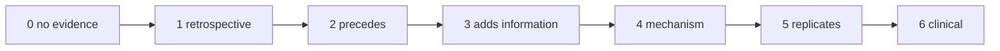

# CLAIM LADDER

**Seven Levels · No Promotion Without Evidence**

---

*"Most collapses of scientific credibility are a Level 1 result described in Level 5 language."*

*— Davarn Morrison, 2026*

---

## Current Position

> **TRANSITION DYNAMICS IS AT LEVEL 0.**
>
> Real physiological data **has** been analysed: seven preregistered
> experiments on VitalDB, four returning NOT SUPPORTED, one SUPPORTED in a
> narrow measurement-level scope, one UNRESOLVED.
>
> The position remains Level 0 because **no experiment produced a supported
> incremental predictive claim**. Negative and unresolved results do not raise
> the ladder. The synthetic benchmark establishes estimator behaviour only and
> is not evidence about human physiology.
>
> Current status: [`CANONICAL_STATUS.md`](CANONICAL_STATUS.md). `main` is the
> canonical branch.

---

## The Ladder

| Level | Claim | Evidence required | Language permitted |
|:--:|---|---|---|
| **0** | No evidence | — | "hypothesis", "proposed", "untested" |
| **1** | Structural quantities correlate **retrospectively** with transition | association in a single cohort, any direction | "associated with", "correlates with". **Never** "predicts" |
| **2** | Structural quantities **prospectively precede** transition | temporal precedence with a blanking window; alert fires while marginals in range | "precedes", "anticipates". **Never** "adds value" |
| **3** | They add predictive information **beyond ordinary biometrics and acquisition behaviour** | M3 > M1 **and** M0 at ACCEPTABLE leakage, nested comparison, out-of-sample | "adds information beyond standard variables" |
| **4** | The **preregistered mechanism** explains the signal better than competing transition models | M3 > M2; z sign matches preregistered direction per class; discrimination survives magnitude matching | "consistent with the preregistered mechanism". **Never** "proves the mechanism" |
| **5** | The effect **replicates** across datasets and transition classes | independent cohort, different site, ≥ 2 transition classes, effect direction preserved | "replicated" |
| **6** | **Prospective clinical validation** demonstrates useful early warning | prospective study, base-rate-realistic PPV, alarm burden, demonstrated benefit | "clinically useful early warning" |

---

## Promotion Rules

> **1  Evidence at level N is NEVER described as evidence for N+1.**
>
> 2  Levels are not skipped. A strong Level 1 result is a Level 1
> result, however strong.
> 3  Promotion past Level 3 requires the M0 gate at ACCEPTABLE.
> A SEVERE leakage verdict caps the programme at Level 1
> permanently, for that dataset.
> 4  Promotion to Level 4 requires the SIGN to match the per-class
> preregistration, not merely a significant effect. A significant
> effect in the wrong direction is evidence AGAINST the mechanism
> while possibly supporting Level 3.
> 5  Promotion to Level 6 requires the base-rate utility gate in
> analysis/base_rates.py. Discrimination alone never reaches
> Level 6, at any effect size.
> 6  A class-specific result is a claim about THAT CLASS. It is not
> promoted to a general claim by pooling.

---

## Language Violations to Watch For

| Written | Actual level | Why it is a violation |
|---|:--:|---|
| "Structural deformation predicts deterioration" | usually 1 | "Predicts" asserts temporal precedence — that is Level 2 |
| "Adds predictive value over standard monitoring" | usually 2 | Requires the M0 gate and a nested comparison — Level 3 |
| "Confirms the yield mechanism" | usually 3 | Requires sign-matched, magnitude-matched discrimination — Level 4 |
| "Generalises to ICU deterioration" | usually 4 | Requires independent replication — Level 5 |
| "Could provide early warning in practice" | usually 4 or 5 | Requires prospective validation and base-rate survival — Level 6 |
| "Detects transitions before biomarkers" | 1 or 2 | Also **not novel** at any level — HeRO and DNB established it |

---

## What Each Level Would Actually Look Like Here

| Level | Concrete instantiation for this programme |
|:--:|---|
| 1 | In HiRID, ΔG in the 8 h pre-event window differs from control windows |
| 2 | That difference is present on windows where every channel is in its person-specific range, with median lead ≥ 2 h, blanking applied |
| 3 | M3 beats M1 by ΔAUPRC with lower bound > 0 out of sample by site, with M0 ratio < 0.50 |
| 4 | Mean z > 0 in T2/T3 and ≈ 0 in T6, at matched ‖ΔG‖, with ΔG failing the same discrimination |
| 5 | The same class-specific sign pattern in MIMIC-IV or eICU |
| 6 | Prospective deployment showing PPV ≥ 0.20 at true prevalence, ≤ 1 false alert per patient, and demonstrated clinical benefit |

**Levels 1 and 2 would largely replicate existing work.** The programme becomes
scientifically interesting at Level 4 and only there.

---

> **The synthetic benchmark is not Level 1.**
>
> It is Level 0 with working code.

---

## Related Work

- [`../README.md`](../README.md) · [`HYPOTHESIS.md`](HYPOTHESIS.md) · [`COMPETING_MODELS.md`](COMPETING_MODELS.md) · [`LIMITATIONS.md`](LIMITATIONS.md)

---

© 2026 Davarn Morrison · Transition Dynamics · Claim Ladder
