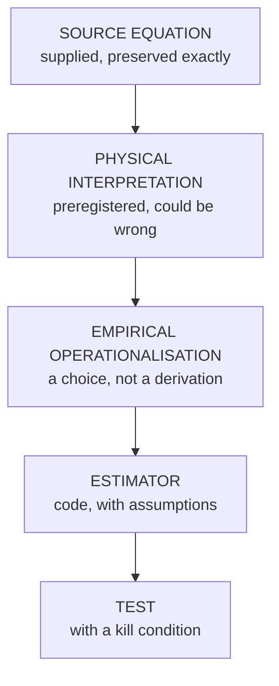

# Mathematical Objects

Every object is presented in five separate layers. **Nothing below the first
layer is source mathematics**, and nothing below it may be attributed to the
original equation set.

**Notation.** $\tau$ denotes a duration throughout. The integration map in the
integrated-deformation object is written $\iota$ to avoid the collision.

---

## 1. Deformation–persistence

### Source equation

$$Q_i = \lVert \Delta G_i \rVert \cdot \tau_i$$

**Status: active.** $\Delta G_i$ is the structural deformation associated with
channel-set or perturbation $i$; $\tau_i$ is its persistence duration.

> The source equation set defines $\Delta G$ **verbally**, not formally. Any
> formula for $\Delta G$ in this repository is an empirical operationalisation
> chosen by us, not part of the supplied mathematics.

### Physical interpretation

Deformation magnitude combined multiplicatively with how long the system stays
deformed. A large brief excursion and a small sustained one are not equivalent.

Interpreted **neutrally**. No claim is made that this quantity demonstrates
qualia or subjective experience.

### Empirical operationalisation

$\Delta G$ is operationalised as the drift of the joint second-order structure
away from a baseline window, and $\tau$ as the contiguous duration above a
threshold fixed per patient at the baseline 95th percentile.

### Estimator

`delta_G_structure`, `Q_deformation_persistence`, with `Q_integral` as a
comparator. Baseline covariance uses shrinkage; without it the estimate is
ill-conditioned at realistic window lengths.

### Test

$\tau$ is defined by a threshold on $\lVert\Delta G\rVert$, so $Q$ is a
deterministic function of $\lVert\Delta G\rVert$ and one constant. "Q carries
information beyond its factors" is therefore not a coherent claim. The testable
claim is that the exponents are equal:

$$\mathrm{logit}(P) = \beta_0 + \beta_1 \log\lVert\Delta G\rVert + \beta_2 \log \tau$$

with the product form corresponding to $\beta_1 = \beta_2$, and requiring
$\beta_1 > 0$, $\beta_2 > 0$.

**Expected direction:** $Q$ rises approaching transition; its advantage over
magnitude alone grows with horizon.
**Null:** $\beta_2 = 0$.
**Falsified if:** $\beta_2$ CI includes 0; or unconstrained exponents beat the
constrained form by $\Delta$AIC > 10; or the integral form
$\int \lVert\Delta G\rVert\,dt$ beats the product form by $\Delta$AIC > 10.

> This reformulation is **ours**, not the source mathematics. If the integral
> form wins, the idea survives and the written product form does not.

---

## 2. Constraint operator

### Source equation

$$Q_G = \Lambda\, Q$$

**Status: active, preregistered.**

### Physical interpretation

$\Lambda$ is preregistered as a **stiffness / precision / resistance-to-deformation**
operator. The source equation constrains $\Lambda$ only to be a linear
operator; it does not fix the interpretation. Choosing one is a commitment made
in advance, and it could be wrong.

The competing resilience/recovery interpretation is a **separate model** —
see [`PHYSICAL_INTERPRETATION.md`](PHYSICAL_INTERPRETATION.md).

### Empirical operationalisation

$\Lambda$ is operationalised as the inverse of the baseline covariance,
computed once on a treatment-quiet baseline window and never re-estimated.

> **EMPIRICAL OPERATIONALISATION, not the source equation.** The source
> equation does not mention covariance.

### Estimator

`freeze_lambda`, which returns the frozen baseline quantities as a read-only
object so that no downstream step can silently re-fit them.

### Test

Whether constraint-weighted deformation improves on unweighted deformation and
on deformation–persistence, in a nested comparison, out of sample.

**Null:** the weighting adds nothing; deformation is isotropic with respect to
the baseline structure.
**Falsified if:** the nested gain CI includes zero **and** the competing
resilience model outperforms.

---

## 3. Critical deformation

### Source equation

$$\lVert \Lambda \Delta G \rVert > T_{\mathrm{critical}}$$

**Status: active, load-bearing.** This is the current primary critical-transition
condition. It is not replaced by any other equation.

### Physical interpretation

A yield-type condition: a regime change occurs when constraint-weighted
deformation exceeds a critical value. The claim is of a **threshold**, not a
smooth risk gradient — that distinction is what makes it testable against
existing early-warning work.

### Empirical operationalisation

The norm is operationalised as a quadratic form in the baseline metric,

$$\lVert \Lambda \Delta G \rVert \;\longrightarrow\; \sqrt{\delta^{\mathsf T} \Sigma_0^{-1} \delta}, \qquad \delta = \mu(t) - \mu_0$$

and $T_{\mathrm{critical}}$ is expressed as a $\chi^2$ quantile so that a
threshold fitted in one cohort is comparable in another with a different number
of channels.

> **EMPIRICAL OPERATIONALISATION.** The quadratic form and the $\chi^2$
> expression are choices we made. They are not in the source equation.

### Estimator

`deformation_energy`, `deformation_energy_chi2`, with an
autocorrelation-corrected effective sample size — physiological channels are
strongly autocorrelated and raw sample counts would overstate significance.

### Test

Fit a threshold hazard model and a smooth monotone hazard model; compare. Then
fit the threshold in one cohort and evaluate it unchanged in another.

**Expected direction:** the quantity rises approaching transition and the
hazard contains a knee.
**Null:** a smooth monotone hazard with no knee.
**Falsified if:** $\Delta$AIC ≤ 10 favouring the smooth model, or the
between-cohort coefficient of variation of the fitted threshold exceeds 0.5.

> Either failure kills the **threshold** claim while possibly leaving a useful
> predictor. Those are different results and must be reported separately.

---

## 4. Integrated deformation

### Source equation

$$C(t) = \tau\!\left( \bigcup_i N_t(X, I_i) \right)$$

**Status: exploratory source object.** Used here only for its higher-order
integration structure, where that is empirically meaningful.

> No claim is made that physiological integration demonstrates consciousness.
> The object is used as a mathematical structure and nothing more.

### Physical interpretation

Integrated multichannel deformation: the *shape* of how channels co-deform,
not merely how many of them do.

### Empirical operationalisation

$N_t(X, I_i)$ is operationalised as the set of times channel $i$ is deformed,
and the integration map $\iota$ as the **nerve** of that cover. A simplex is
included when its channels co-deform on at least a support fraction of the
window. Intersection support decreases under supersets, so the family is
automatically downward closed and forms a valid simplicial complex.

### Estimator

`codeformation_complex` → `betti_numbers` → `beta1_excess_over_pairwise`.

### Test

> **"Multivariate beats univariate" is not the claim.** That is already
> established elsewhere and is not tested here as a contribution.

The claim is that higher-order structural information exists which **cannot be
reconstructed from pairwise relationships alone.**

The observable that tests it: Gaussian surrogates matched to the window's mean
and covariance preserve every pairwise relationship and nothing higher, by
construction. So their distribution of the first Betti number is exactly "what
would be seen if only pairwise structure existed":

$$z_{\beta_1} = \frac{\beta_1^{\text{obs}} - \overline{\beta_1^{\text{surr}}}}{\mathrm{sd}\,\beta_1^{\text{surr}}}$$

$\beta_1$ depends on which triangles are filled — third-order co-deformation —
and is provably not a function of the pairwise supports alone.

**Expected direction:** $z_{\beta_1} > 0$ approaching transition.
**Null:** $z_{\beta_1} = 0$.
**Falsified if:** the CI includes zero, or a model containing every pairwise
relationship matches the augmented model.

---

## 5. Demoted objects

Two source objects are demoted from the primary hypothesis. They are preserved
in [`DEMOTED_OBJECTS.md`](DEMOTED_OBJECTS.md) with full reasoning and may not
support any biomedical claim.

$$\exists k : H_k(\mathrm{Reach}(X_t)) \not\cong H_k(\mathrm{Reach}(X_0))$$

$$\forall\, \Delta\ell \in L,\ \ \Delta R_C(t) = 0$$

---

## Summary
> **Status updated 2026-09-12.** The five-layer separation below is preserved
> exactly. Failures recorded in this repository are attributed to the layer that
> was actually tested — a failed PHYSICAL INTERPRETATION, EMPIRICAL
> OPERATIONALISATION or ESTIMATOR is **not** recorded as a failure of the SOURCE
> EQUATION unless the source relationship itself was tested. No experiment in
> this repository has tested a source relationship directly.
>
> | Object | Layer tested | Layer that failed | Verdict |
> |---|---|---|---|
> | $Q_i=\lVert\Delta G_i\rVert\tau_i$ | operationalisation (run-length) | operationalisation | **DEMOTED** — gain reproduced by an order-destroying control |
> | $Q_G=\Lambda Q$, $\Lambda=\Sigma_0^{-1}$ as stiffness | physical interpretation | **physical interpretation** | **DEMOTED** — source relation untested |
> | $\Sigma_0^{-1}$ as whitening metric | estimator $S(t)$ | estimator | **NOT SUPPORTED** |
> | $\lVert\Lambda\Delta G\rVert>T_c$ | none | — | **UNOPERATIONALISED** |
> | $C(t)$ | none on real data | — | **EXPLORATORY — synthetic only** |
> | $H_k(\mathrm{Reach})$ | none | — | **DEMOTED / UNOPERATIONALISED** |
> | orthogonality law | prior audit | — | **DEMOTED** |
>
> Current status: [`CANONICAL_STATUS.md`](CANONICAL_STATUS.md). `main` is the
> canonical branch.

| Object | Layer 1 status | Kill condition |
|---|---|---|
| $Q_i = \lVert\Delta G_i\rVert\tau_i$ | **DEMOTED** (operationalisation) | $\beta_2 = 0$, or integral form wins |
| $Q_G = \Lambda Q$ | **Source relation untested; its stiffness INTERPRETATION is DEMOTED** | Nested gain CI includes 0 |
| $\lVert\Lambda\Delta G\rVert > T_c$ | **UNOPERATIONALISED / HISTORICAL** — never estimated | Smooth hazard fits as well |
| $C(t) = \tau(\bigcup_i N_t)$ | Exploratory | $z_{\beta_1}$ CI includes 0 |
| Reach / homology | Demoted | — |
| Orthogonality law | Demoted | — |

---

© 2026 Davarn Morrison · Transition Dynamics
