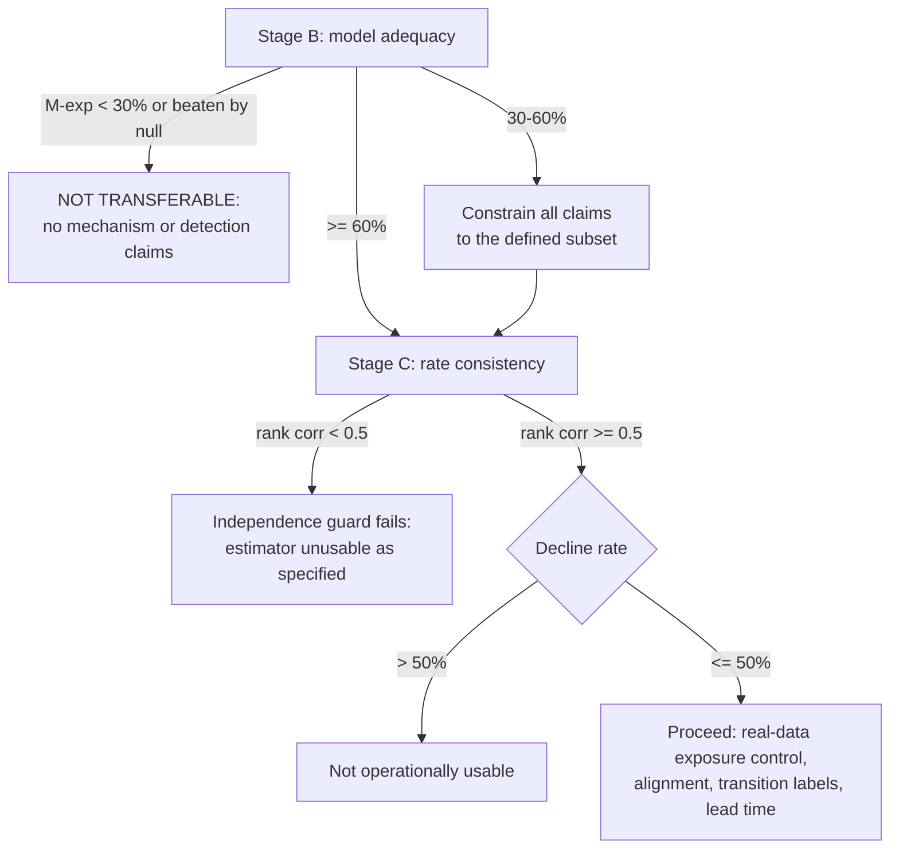

# Preregistered protocol — onset-model adequacy on real physiology

**Written before any real-data analysis. Thresholds fixed here are not
revisable after seeing results.**

The question is **not** whether Transition Dynamics predicts deterioration. It
is narrower and prior:

> Do real pre-transition physiological trajectories support the dynamical form
> the onset estimator assumes?

$$\delta_i(t) = b_i\left(1 - e^{-k_i (t - t_0)}\right), \qquad t \ge t_0$$

with $k_i$ informed by baseline dynamics. If this form is not adequate, the
onset estimator is inapplicable to real data, exposure control is unavailable,
and the mechanism claim returns to non-identifiable regardless of the synthetic
results.

---

## Stage A — admissibility and estimation rules

### A1. Admissible baseline window

| Rule | Value |
|---|---|
| Minimum duration | 4 h (ICU) or 25% of recording, whichever is longer |
| Treatment quiet | no vasopressor/sedation/fluid-bolus change recorded within the window |
| Separation from any event | ends ≥ 2 h before the transition, or ≥ 2 h before recording end for control recordings |
| Effective sample size | $n_{\text{eff}} = n(1-\rho)/(1+\rho) \ge 10p$, computed per recording |
| Stationarity screen | mean of first vs last third differs by < 0.5 baseline SD on every channel |

A recording failing any rule is **excluded before analysis**, and the exclusion
count is reported.

### A2. Rate estimation

$k_i$ from **baseline only**, via lag-1 autocorrelation, $k_i = -\log a_i / h$.
No post-baseline data, no labels, no alignment. Where channels are mixtures
rather than eigen-coordinates, this is an *effective* rate and is labelled as
such.

### A3. Onset estimation

Profile least squares over a grid of candidate $t_0$; per-channel amplitudes
$b_i$ in closed form given $(t_0, k)$; selection by **held-out** error.

### A4. Held-out scoring — BLOCK, not interleaved

Scoring uses **contiguous blocks**, not alternating samples.

> This differs from the synthetic harness and the difference is deliberate.
> Interleaved splitting does not control overfitting on autocorrelated data:
> with lag-1 correlation near 0.76 the held-out half is close to a copy of the
> fitting half. Real physiology is more strongly autocorrelated than the
> simulator, so interleaving would be worse there, not better.

Five contiguous folds; fit on four, score on the held-out block; report mean
held-out mean-squared error.

### A5. Minimum requirements

| Requirement | Value |
|---|---|
| Channels | ≥ 4 simultaneously recorded |
| $n_{\text{eff}}$ in baseline | ≥ 10p |
| $n_{\text{eff}}$ in analysis window | ≥ 20 |
| Missingness | ≤ 20% per channel; gaps > 2 sampling intervals not forward-filled |
| Recordings | ≥ 50 admissible for any adequacy conclusion |

### A6. Declining

The estimator may return "onset not identifiable". Threshold calibrated on the
**null distribution of the same recording type**, not chosen by inspection.

**Permitted decline rate: up to 50%.** Above that the estimator is declared
**not operationally usable** on that data, regardless of how well it performs
on the remainder — because a method that answers on a self-selected half is
conditioned on a filter of unknown structure. This is the unresolved
differential-decline problem (`CANONICAL_STATUS.md` L2) and it is treated as
disqualifying here rather than deferred.

---

## Stage B — model comparison

The exponential-approach model is compared against alternatives on **held-out**
error. In-sample fit is not reported as evidence.

| Model | Form | Free parameters |
|---|---|---|
| **M-null** | $\delta_i(t)=0$ | 0 |
| **M-const** | $\delta_i(t)=c_i$ | $p$ |
| **M-lin** | $\delta_i(t)=c_i + m_i t$ | $2p$ |
| **M-exp** (the assumed model) | $b_i(1-e^{-k_i(t-t_0)})$, $k$ from baseline | $p+1$ |
| **M-exp-free** | as above, $k$ fitted rather than from baseline | $2p+1$ |
| **M-spline** | natural cubic spline, 4 knots | $4p$ |
| **M-rw** | random walk / local level | $p$ |

### AMENDMENT 1 — 2026-09-11, before any real-data result

Calibration on synthetic nulls, run before real data, showed the fixed
selection-rate threshold is not interpretable on its own:

| data | M-exp selected |
|---|:--:|
| generated by the exponential model | 6/6 |
| **stationary, no onset** | **4/6 (67%)** |
| phase-randomised surrogate of the same stationary data | 1/6 |

A purely stationary recording would clear the 60% bar. M-exp absorbs slow
drift, so its null selection rate is high whenever the data are
autocorrelated — which real physiology always is.

**The selection rate is therefore compared against the rate on
phase-randomised surrogates of the same recording**, which preserve each
channel's power spectrum and autocorrelation while destroying deterministic
onset structure. The fixed thresholds below are retained but are now
**necessary and not sufficient**: M-exp must also be selected substantially
more often on the real recording than on its own surrogates, with a bootstrap
CI on the difference excluding zero.

This amendment is recorded before any real-data result and tightens the
criteria rather than loosening them.

### AMENDMENT 2 — 2026-09-11, same date

The spline comparator was a straw man. A raw truncated-power cubic basis
extrapolates catastrophically, and under block cross-validation the first and
last folds are extrapolation, so its held-out error came out four orders of
magnitude worse than every other model. **M-spline is now a natural cubic
spline**, linear beyond the boundary knots, as the protocol always claimed.
Its held-out error falls from ~22500 to ~1.8, making it a real alternative.

### Preregistered reading

| Result | Conclusion |
|---|---|
| M-exp has lowest held-out error in **≥ 60%** of admissible recordings, and beats M-lin and M-spline by ΔMSE with bootstrap CI excluding zero | **Adequate** |
| M-exp preferred in 30–60% | **Narrow subset.** Define the subset explicitly by recording characteristics fixed in advance (channel set, sampling rate, baseline length) and constrain all future claims to it |
| M-exp preferred in **< 30%**, or beaten by M-const or M-rw | **Not transferable.** The onset model does not describe real physiology. Do not proceed to mechanism or early-detection claims |
| M-exp-free ≫ M-exp | The *form* may be right while **baseline rates are uninformative**, which breaks the independence the estimator relies on. Treated as failure of the protocol as specified |

Also reported: per-recording fit, calibration of predicted versus observed
displacement, residual autocorrelation and heteroscedasticity, and whether any
superiority is robust across channels and across recordings rather than driven
by a few.

---

## Stage C — rate consistency

The estimator's independence rests on baseline rates being informative about
post-baseline curvature. Tested directly, with **temporal separation**: rates
from the baseline window, curvature from the analysis window, never the same
observations.

Reported: bias, correlation, Bland–Altman agreement, per-channel error where
channel pairing is meaningful, geometric-mean and spectrum-level agreement
where channels are mixtures, and failure regimes.

**Preregistered reading:** rank correlation between baseline-derived and
curvature-derived rates **≥ 0.5** with CI excluding zero. Below that, baseline
rates are not informative about post-baseline dynamics and the estimator's
independence guard fails.

---

## Stage D — no labels in the first pass

The first pass uses **no transition-class labels**. The question is whether the
assumed dynamics exist in real multichannel trajectories, which is answerable
without knowing what happened to the patient.

Labels enter only at Stage E, and only if Stages B and C pass.

---

## Stage E — decision rule

No new theory may be introduced to rescue a failure. The equations are not to
be reinterpreted. The primary hypothesis does not change.

---

## What this protocol can and cannot be run on today

The full protocol requires **multichannel ICU recordings with transition
events**. See [`DATA_REQUIREMENTS_REAL.md`](DATA_REQUIREMENTS_REAL.md) for the
exact dataset, files, variables and minimum cohort, and for the access blocker.

A **reduced pre-check** is runnable now on real resting human physiology, with
no transition events. It cannot assess adequacy of the onset form, because
there is no onset. It can test one necessary condition:

> On genuinely stationary real physiology, does the estimator correctly
> **decline**, or does real physiological noise — 1/f structure,
> non-Gaussianity, respiratory and cardiac periodicity, slow drift — make it
> hallucinate onsets that are not there?

**Preregistered reading of the reduced pre-check:** the estimator must decline
on **≥ 80%** of stationary real segments, matching the 80–95% it achieves on
simulated stationary data. Below 80% it has a real-data false-positive problem
that the simulator did not reveal, and the full study must address that before
proceeding.

This pre-check is a necessary condition, not a sufficient one. Passing it does
**not** constitute evidence of model adequacy.

---

© 2026 Davarn Morrison · Transition Dynamics
